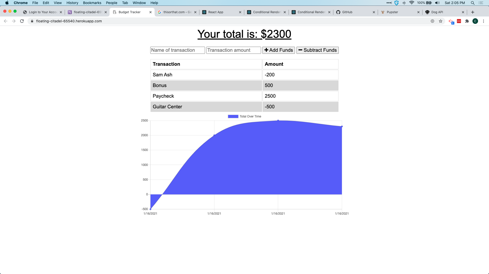

  # Budget Tracker App 

  # Table of Contents 

  [Description](#description) 

  [Technologies Used](#technologies-used) 

  [Screenshots](#application-screenshots) 

  [Installation](#installation) 

  [Application Usage](#usage) 

  [Credits](#credits) 

  [Deployed Application](#deployed-application) 

  [License](#license) 

  ## Description 

  An application for tracking your income and expenses with a visualization 

  ## Technologies Used 

  NodeJS,NPM,MongoDB,Express,Morgan and Compression 

  ## Application Screenshots
    

  ## Installation 

  fork repo then clone to local machine. navigate to project root directory and run npm install to install all depencies (a local instance of mongodb should also exist). Once all the dependencies have been installed run npm start from terminal and navigate to localhost using port 3000
  ## Usage 

  Launch the application and enter your income and expenses 

  ## Credits 

  NodeJS, NPM, MongoDB, Express, Morgan, Compression 

  ## Deployed Application 

  https://floating-citadel-65540.herokuapp.com 

  ## License 

  Licensed under the [MIT](LICENSE) license.
  